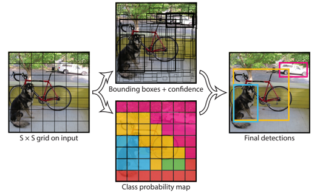

# r2cv-dl-yolo
深層学習の紹介とYoloV3のサンプルモデルを準備しました。
## 目次
[1. 深層学習](#1)

[2. ROBO-ONE auto　Yolo-v3-tiny モデル](#2)

[3. ROBO-ONE 剣道 Yolo-v3-tiny モデル](#3)


[R2CVに戻る](https://github.com/nishibra/r2cv-1)

<a id="1"></a>
## 1.深層学習
画像の深層学習には画像分類/物体認識/セグメンテーションがあります。
### 画像分類(Classification)
画像分類するアルゴリズムです。
### 物体認識(Object detection)
> 1: 物体領域候補の抽出
> 
> 2: 物体領域候補の物体認識
>
>  3: 検出領域の絞り込み

を行い物体とその位置を認識します。
以下の手法があります。
### SSD (Single Shot Multibox Detector)
 SSD は深層学習ベースの物体検出アルゴリズム，物体候補領域の生成と分類を同時に学習・実行することが可能です。
### YOLO(You only look once)
   YOLO では領域候補の抽出するのではなく直接的に物体検出をしようというものです。
#### Yolo-V3(論文より引用)
   
   
   
   
### 領域分割(Segmentation)
 画像の領域を分割するタスクをSegmentation(領域分割)と呼び、Semantic Segmentationは「何が写っているか」で画像領域を分割するタスクのことを指す。

<a id="2"></a>
## 2-1. ROBO-ONE autoリモートモデル(深層学習 Yolo v3の推論サンプル)
[ROBO-ONE auto](https://www.robo-one.com/autos/index/63)は二足歩行ロボットによる自律型の格闘競技です。ここではリモート大会のための推論モデルを作成してみました。
モデルは容量が大きいので、以下よりダウンロードします。

>download: 
[Yolo-v3-tiny auto Model .zip file](http://www.arrc.jp/auto/auto_dl_model.zip)

解凍して、カメラを接続し、airrc/auto_dlフォルダに移り、以下のプログラムを実行するとROBO-ONE autoリモートで使用するダミーロボットとグリーンボトルを認識できます。
```
$ cd airrc/auto_dl
$ pythin3 auto_dl.py
```


<a id="3"></a>
## 2-2. ROBO-ONE autoモデル(深層学習 Yolo v3の推論サンプル)

以下はautoでROBO-ONEに参加するためのモデルです。
上記と同様に使用出来ます。

>auto用モデル
[auto_model_20230725.zip](http://www.arrc.jp/auto/auto_model_20230725.zip)

## 3. ROBO-ONE 剣道モデル(深層学習 Yolo v3の推論サンプル)
[ROB-ONE剣道](https://www.robo-one.com/ken2s/index/59)のAutoのための深層学習推論モデルです。
面、小手、胴とリングのエッジを認識します。
>download: 
[Yolo-v3-tiny kendo Model .zip file](http://www.arrc.jp/auto/kendo_dl.zip)


---
#### <画像処理関連参考資料>
> [RaspberyPi4で画像処理](http://biped-robot.or.jp/upload/dbmaterials/1018_466a1053ca4d7568f2cdb5d1fba1c21aoriginal.pdf)
>
> [物体検出についての歴史まとめ(1)](https://qiita.com/mshinoda88/items/9770ee671ea27f2c81a9#%E3%82%A2%E3%83%B3%E3%82%AB%E3%83%BC%E3%83%9C%E3%83%83%E3%82%AF%E3%82%B9%E3%81%AE%E5%B0%8E%E5%85%A5)
>
> [物体検出についての歴史まとめ(2)](https://qiita.com/mshinoda88/items/c7e0967923e3ed47fee5)
>
> [MobileNet-SSD v1](https://www.haneca.net/python-opencv-dnn-object-detection/)
>
>[ディープ・ラーニングにおける物体検出 ](https://blogs.sas.com/content/sasjapan/2019/03/12/understanding-object-detection-in-deep-learning/)


#### <Yolo関連参考資料>
> [Windows 10上のDarknetでYolo v3をトレーニングしOpenCVから使ってみる](https://nixeneko.hatenablog.com/entry/2018/08/15/000000)
>
> [YoloV3とOpenCVを使用したオブジェクト検出](https://ichi.pro/yolov-3-to-opencv-o-shiyoshita-obujyekuto-kenshutsu-28510119961632)
> 
> [You Only Look Once: Unified, Real-Time Object Detection](https://arxiv.org/abs/1506.02640)
>
> [物体検出に独自データを学習させる（顔ロボット）](https://hajimerobot.co.jp/ai/yolo_originaldata/)
